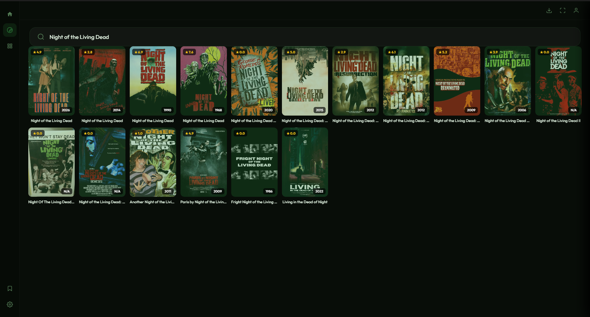
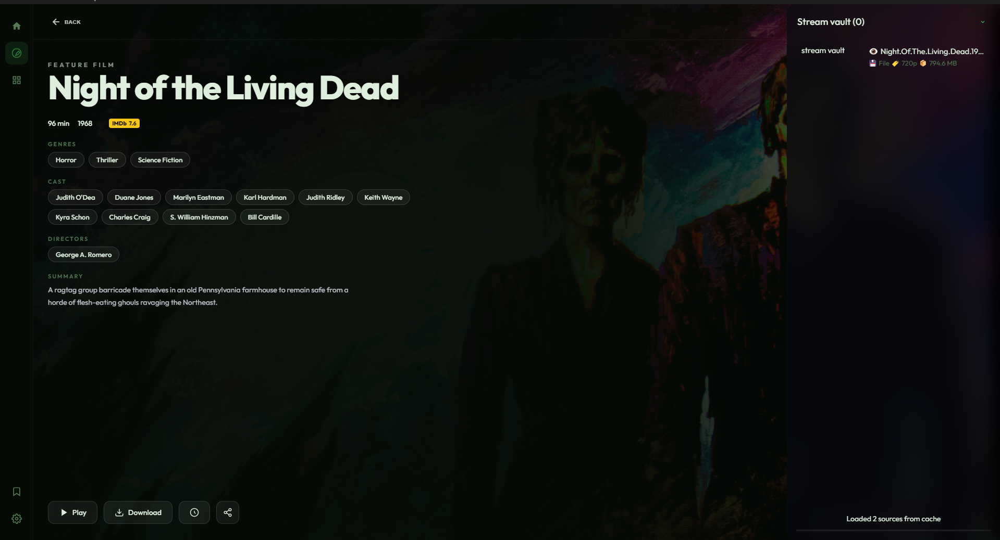

# Cuscuta

**Cuscuta** is a self-hosted media streaming and downloading application built around **TDLib**. It lets you access media files from sources you provide, inspect their metadata, stream them in the browser, seek through partially available files, download them, and handle multiple audio and subtitle tracks.

Cuscuta is designed to work with media files that you **own or have the legal right to access, stream, and download**.

> **Cuscuta does not host, distribute, or provide any media files.**
> It only processes and filters files available through a source configured or provided by the user.

**Repository:** https://github.com/Bujairkc/Cuscuta.git

---
## Screenshots






## Features

* 🎬 **Browser-based media player**
* 📦 **MKV and MP4 support**
* ⚡ **Streaming without waiting for the complete file**
* ⏩ **Seek support** for supported media files
* 📥 **Download media files**
* 🎵 **Multiple audio tracks**
* 💬 **Multiple subtitle tracks**
* 📺 **Embedded subtitle support**
* 🔍 **File and movie searching**
* 🖼️ **Poster and metadata support using TMDB**
* 💾 **Saved Messages media support**
* 📡 **Streaming from files available through TDLib**
* 📊 **Media metadata and track detection**
* 🧩 **Partial-file playback support**
* 🔄 **Download and playback can work independently**
* 🌐 **Designed for browser-based playback**

---

## How Cuscuta Works

Cuscuta does not maintain its own media library.

Instead, you provide a source containing media files that you are legally allowed to access.

For example, a source may contain files stored in your own channels, bots, or Saved Messages.

Cuscuta can use the **file name, file ID, or other available information** to locate a file from your configured source.

The general flow is:

```text
Your Source
    │
    ▼
   TDLib
    │
    ▼
 Cuscuta
    │
    ├── Search / Filter
    ├── Metadata
    ├── Poster
    ├── Track Detection
    │
    ▼
 Media Engine
    │
    ├── Stream
    ├── Seek
    ├── Download
    └── Subtitle / Audio Tracks
```

Cuscuta only operates on files that are available from the source you provide.

---

## Search

Cuscuta can use information such as a **file name, movie name, series name, or file ID** to find matching media from your configured source.

For example:

```text
Movie Name Year
```

Cuscuta can use the available information to locate the corresponding file from your source.

The source must contain media that you have the legal right to access and use.

---

## TMDB Metadata

Cuscuta can use **The Movie Database (TMDB)** to retrieve movie and television metadata such as:

* Posters
* Backdrops
* Titles
* Release information
* Genres
* Movie/TV metadata

TMDB is used for **metadata and artwork**, not for obtaining the media files themselves.

Cuscuta is not affiliated with or endorsed by TMDB.

---

## Streaming

Cuscuta is designed around streaming media directly from the available file source.

It can request the portions of a file needed for playback instead of necessarily downloading the entire file before playback begins.

This allows features such as:

* Start playback while a file is still being retrieved
* Seek to different positions
* Request different portions of a media file
* Play partially downloaded media where the format and available data permit it

For formats such as MKV, Cuscuta uses the container structure and available indexing information to locate the relevant portions of the file.

---

## Partial File Playback

One of the goals of Cuscuta is to support playback when the complete file is not yet available.

For example:

```text
Large MKV
│
├── Already available
│       └── Playback can begin
│
├── Current playback position
│       └── Required data requested
│
└── Remaining data
        └── Retrieved when needed
```

The exact behavior depends on the media container, codecs, indexes, and whether the required data is available.

---

## MKV

Cuscuta contains functionality for inspecting MKV container structures and locating useful metadata. This is powered by the **NoriJS (Nori)** library, which handles low-level parsing and navigation of MKV/EBML data so the player can efficiently understand and request only the required parts of a file.

This includes working with concepts such as:

* EBML
* Segment
* SeekHead
* Tracks
* Clusters
* Cues
* Blocks
* Audio tracks
* Video tracks
* Subtitle tracks

Using NoriJS, Cuscuta can interpret MKV structure in a streaming-friendly way, allowing it to improve seeking accuracy and enable targeted data retrieval without needing to fully download the file.

The player can use available indexing information to improve seeking and targeted data retrieval.

---

## MP4

Cuscuta also supports MP4 files, with parsing and structure analysis handled through the **NoriJS (Nori)** library.

MP4 metadata such as the `moov` atom can be inspected using NoriJS to determine the information required for playback and seeking. This allows Cuscuta to understand track layout, timing data, and sample indexing in a structured way.

Depending on how the MP4 was created, metadata may be located at the beginning or elsewhere in the file, so the player may need to retrieve the appropriate portion before playback can begin. NoriJS helps locate and interpret this metadata efficiently so playback can start as soon as the required data is available.

---

## Audio & Subtitle Tracks

Cuscuta supports media containing multiple tracks.

For example:

```text
Movie.mkv

Video
 └── H.264 / H.265

Audio
 ├── English
 ├── Japanese
 └── Malayalam

Subtitles
 ├── English
 ├── Malayalam
 └── Korean
```

The player can expose available tracks and allow the user to select the appropriate audio or subtitle track.

---

## Saved Messages

Cuscuta can also work with media available in **Saved Messages** through TDLib.

This allows users to use their own stored media as a source without requiring a separate media hosting service.

The same legal-use requirements apply: you should only stream or download content that you have the right to access and use.

---

## Downloading

Cuscuta supports downloading media files from the configured source.

The download system is designed separately from playback so that a user can:

* Stream a file
* Seek during playback
* Download the file
* Continue working with other media

depending on the availability of the source and file.

---

## Supported Formats

| Format | Support |
| ------ | ------- |
| MKV    | ✅       |
| MP4    | ✅       |

Codec support ultimately depends on the browser/media engine and the codecs contained inside the file.

---

## Requirements

* Node.js
* npm
* A configured TDLib environment
* A source containing media files you are legally permitted to access

---

## Installation

Clone the repository:

```bash
git clone https://github.com/Bujairkc/Cuscuta.git
cd Cuscuta
```

Install dependencies:

```bash
npm install
```

Start Cuscuta:

```bash
npm start
```

---

## Legal & Content Disclaimer

Cuscuta is a **media access and playback application**. It is not a media hosting service.

Cuscuta does **not**:

* Host movies or television shows
* Provide a built-in copyrighted media library
* Upload media for users
* Distribute media files
* Provide links to unauthorized copies
* Guarantee that content available through a user's configured source is legal

Cuscuta only works with files made available through sources configured or provided by the user.

### User Responsibility

You are responsible for the content you access, stream, download, or otherwise use with Cuscuta.

Only use Cuscuta with media that:

* You own, or
* You have permission to access, or
* You otherwise have a legal right to access and use.

The developers of Cuscuta do not control what users store in or retrieve from their own sources and are not responsible for a user's misuse of the software.

**Do not use Cuscuta to access, stream, download, or redistribute media without the required legal rights.**

---

## No Media Hosting

Cuscuta itself does not host any media files.

It acts as an application that can:

```text
Discover → Retrieve → Parse → Stream → Download
```

media that is already available from a source supplied by the user.

---

## Privacy

Cuscuta operates using user-provided sources and configuration.

No central media library is maintained by the project.

External services like TMDB may process requests according to their own policies.

---

## Technology

* TDLib
* Node.js
* JavaScript
* Browser Media APIs
* NoriJS (MKV/MP4 parsing)
* TMDB API

---

## Project Status

Cuscuta is actively developed. Some formats and edge cases may behave differently depending on encoding and container structure.

---

## License

Cuscuta is licensed under the **GNU General Public License v2.0 (GPL-2.0)**.

See [`LICENSE`](LICENSE) for full details.

---

## Disclaimer

Cuscuta is provided for legitimate personal and technical use only.

The project does not endorse or support copyright infringement.

Use responsibly and only with content you are legally permitted to access.

## Copyright 2026 Sea On Side
